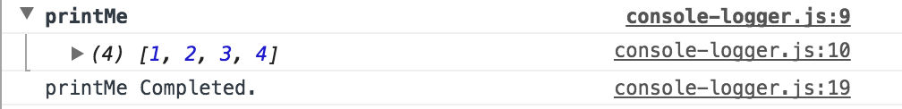

# Observable#consoleLogger

[RxJS 7](https://github.com/ReactiveX/rxjs) operator for printing Observable values to the console.

```ts
import { of } from 'rxjs'
import { debug /* OR consoleLogger */ } from 'rxjs-console-logger'

of([1, 2, 3, 4]).pipe(debug('printMe'))
```


